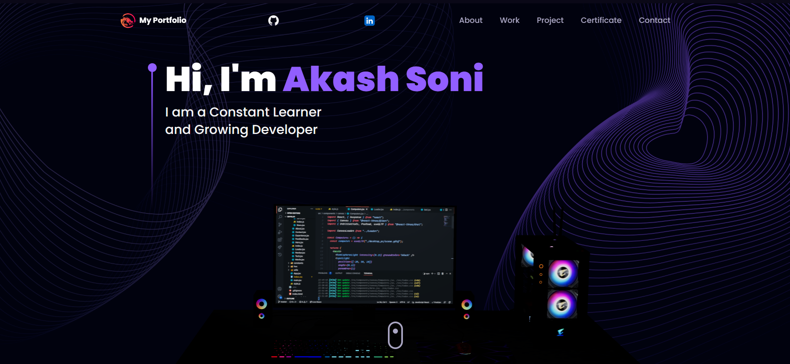

# Wecome to my Portfolio. 🖤

## Visit: [Portfolio](https://akashsoni.netlify.app/) 🚀

## 📝 Description

This is my **3D Portfolio** which is a well-designed and fully functional portfolio website that is built with React.js and Three.js. It is a fully responsive website that works well on all devices.It will provide all the necessary technical details about me also it includes all the **projects** I have buided and my **certification**.

## ✨ Technologies Used

<b>3D Portfolio</b> is built using the following technologies:

- [TypeScript](https://www.typescriptlang.org/): TypeScript is a typed superset of JavaScript that
  compiles to plain JavaScript.
- [Vite](https://vitejs.dev/): Vite is a build tool that aims to provide a faster and leaner
  development experience for modern web projects.
- [React.js](https://reactjs.org/): React is a free and open-source front-end JavaScript library for
  building user interfaces or UI components.
- [Three.js](https://threejs.org/): Three.js is a cross-browser JavaScript library and application
  programming interface used to create and display animated 3D computer graphics in a web browser
  using WebGL.
- [Framer Motion](https://www.framer.com/motion/): Framer Motion is a production-ready motion
  library for React.
- [Tailwind CSS](https://tailwindcss.com/): Tailwind CSS is a utility-first CSS framework for
  rapidly building custom user interfaces.
- [ESLint](https://eslint.org/): ESLint is a static code analysis tool for identifying problematic
  patterns found in JavaScript code.
- [Prettier](https://prettier.io/): Prettier is an opinionated code formatter.
- [Vercel](https://vercel.com/): Vercel is a cloud platform for frontend developers, providing the
  frameworks, workflows, and infrastructure to build a faster, more personalized Web.

 

